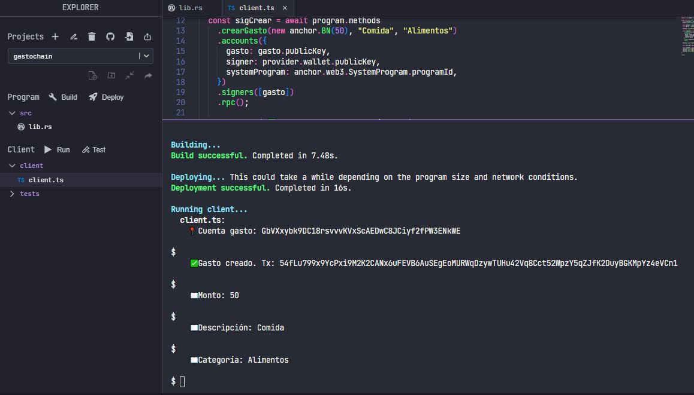
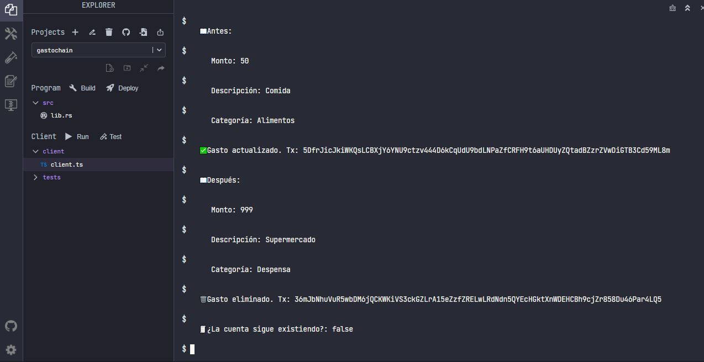

# GastoChain

GastoChain es un smart contract desarrollado en Solana usando Anchor que permite registrar gastos personales en blockchain.

## 🚀 Funcionalidades

- Crear un gasto
- Leer un gasto
- Actualizar un gasto
- Eliminar un gasto

## 📦 Estructura del gasto

Cada gasto almacena:

- Monto (u64)
- Descripción (String)
- Categoría (String)

## 🛠 Tecnologías utilizadas

- Solana
- Rust
- Anchor Framework
- TypeScript

## ⚙️ Cómo funciona

El programa crea una cuenta en la blockchain donde se guarda un gasto.  
Luego permite leer y actualizar esa información directamente on-chain.

## 📊 Ejemplo

### Antes:
Monto: 50  
Descripción: Comida  
Categoría: Alimentos  

### Después:
Monto: 999  
Descripción: Supermercado  
Categoría: Despensa  

## 📸 Evidencia

### Resultado en ejecución

## 📸 Evidencia completa

### Flujo CRUD en ejecución

## 👩‍💻 Autor

Nancy Johana Frias Romero
